# Pixiu-Admin Deployment and Configuration Guide

**English** | [中文](README_CN.md)

**Pixiu-Admin** is a management platform based on the **Pixiu** ecosystem, primarily used for configuring, monitoring, and managing Pixiu gateway resources. It provides centralized management functionality via a web user interface and RESTful API. This document explains how to deploy and configure Pixiu-Admin in a Linux environment.

For backend API documentation, please refer to [API.md](../admin/API.md).

## Deployment Documentation

### Start Using Docker

First, ensure you are in the root directory of the project (the directory containing the Dockerfile). Then, start instantly with Docker Compose:

```bash
docker-compose up -d
```

### Deploy from Source Code

If you prefer not to use Docker, you can download the source code by running:

```bash
git clone https://github.com/apache/dubbo-go-pixiu
```

### Deploy etcd

To manually deploy the etcd service, run the following command:

```bash
docker run -d -p 2379:2379 --env ALLOW_NONE_AUTHENTICATION=yes --name etcd bitnami/etcd
```

For M1/M1 Pro users, use the following command:

```bash
docker run -d -p 2379:2379 --platform linux/amd64 --env ALLOW_NONE_AUTHENTICATION=yes --name etcd bitnami/etcd:3.5.1
```

### Run Admin

#### Run from Source Code

Go to the project directory and run:

```bash
cd dubbo-go-pixiu
# Run directly
go run ./cmd/admin/admin.go -c /your/local/path/conf.yaml
# Run in the background
nohup go run ./cmd/admin/admin.go -c /your/local/path/conf.yaml &
```

#### Run Pixiu

Default config can refer to [pixiu_with_admin_config.yaml](../configs/pixiu_with_admin_config.yaml)

```bash
go run ./cmd/pixiu/pixiu.go gateway start -c ./configs/pixiu_with_admin_config.yaml
```

### Test Running Admin Web

Go to the `web` directory and install dependencies:

```bash
cd ./admin/web/
yarn install  # Install dependencies
yarn run serve  # Test run
```

#### Admin Web Configuration

Edit the `vue.config.js` file in the `web` directory to configure the backend service address:

```
devServer: {
    host: '0.0.0.0',
    port: 8080,  // Web app address
    hot: true,
    https: false,
    open: false,
    disableHostCheck: true,
    proxy: {
        "/config": {
            target: "http://127.0.0.1:8081",  // Backend service address
            ws: true,  // Enable websockets
            changeOrigin: true,  // Enable proxy
        }
    }
}
```

After running successfully, you can access the Admin web interface in the browser at [http://127.0.0.1:8081/login.html#/Overview](http://127.0.0.1:8081/login.html#/Overview).

## II. Related Operations

### Resource Management (Mapping)

#### Create Mapping Configuration

1. Click "Mapping Configuration" to enter the mapping configuration list interface.
2. Click the "Add" button in the top right to create a new mapping configuration.

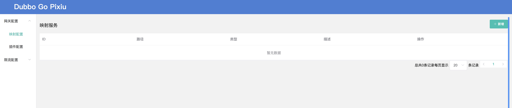

Type the mapping configuration in the code editor and click "Confirm" to create it.

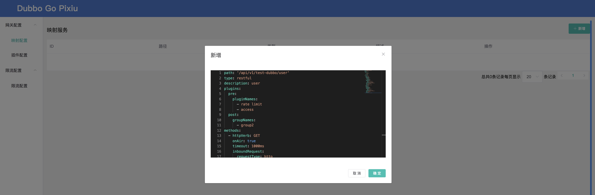

#### Mapping Configuration Example

```yaml
path: '/api/v1/test-dubbo/user'
type: restful
description: user
filters:
  - filter0
methods:
  - httpVerb: GET
    onAir: true
    timeout: 1000ms
    inboundRequest:
      requestType: http
      queryStrings:
        - name: name
          required: true
    integrationRequest:
      requestType: dubbo
      mappingParams:
        - name: queryStrings.name
          mapTo: 0
          mapType: "java.lang.String"
      applicationName: "UserProvider"
      interface: "com.ic.user.UserProvider"
      method: "GetUserByName"
      group: "test"
      version: 1.0.0
      clusterName: "test_dubbo"
  - httpVerb: POST
    onAir: true
    timeout: 10s
    inboundRequest:
      requestType: http
    integrationRequest:
      requestType: dubbo
      mappingParams:
        - name: requestBody._all
          mapTo: 0
          mapType: "object"
      applicationName: "UserProvider"
      interface: "com.ic.user.UserProvider"
      method: "CreateUser"
      group: "test"
      version: 1.0.0
      clusterName: "test_dubbo"
```

#### View and Delete Mappings

1. After refreshing the mapping list, you can view and delete configurations.

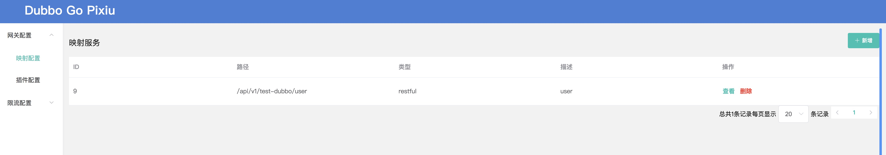

2. Clicking "Delete" will remove the mapping configuration, while "View" will take you to the details page.

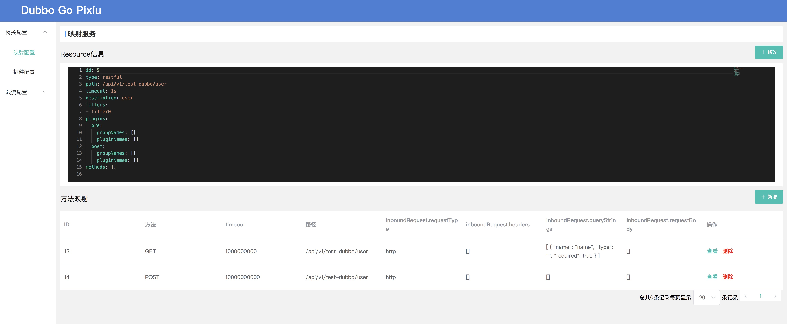

#### Edit Mapping

You can modify the mapping configuration in the edit area and click "Save" to apply changes.

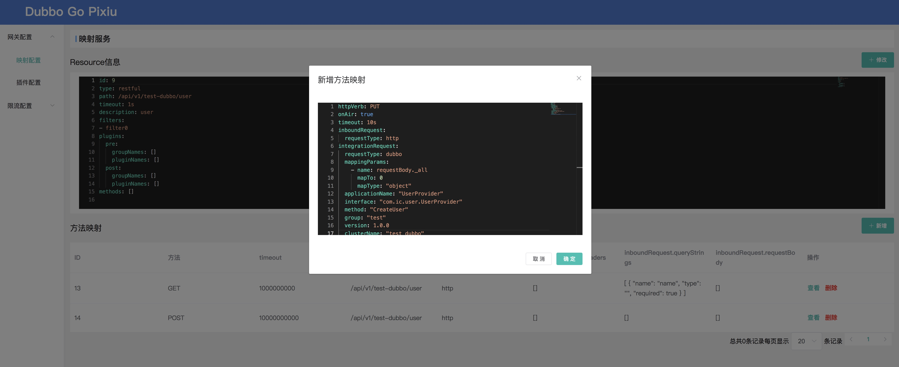

#### Method Mapping

Click the "Add" button to add a new method mapping. Example:

```yaml
httpVerb: PUT
onAir: true
timeout: 10s
inboundRequest:
  requestType: http
integrationRequest:
  requestType: dubbo
  mappingParams:
    - name: requestBody._all
      mapTo: 0
      mapType: "object"
  applicationName: "UserProvider"
  interface: "com.ic.user.UserProvider"
  method: "CreateUser"
  group: "test"
  version: 1.0.0
  clusterName: "test_dubbo"
```

After confirming, the method mapping will appear in the list.

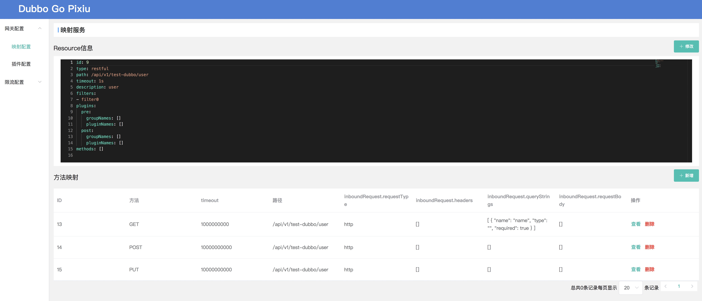

#### View and Delete Method Mappings

You can view detailed information of method mappings or delete them.

For example, change the `httpVerb` of the second method mapping from POST to DELETE.

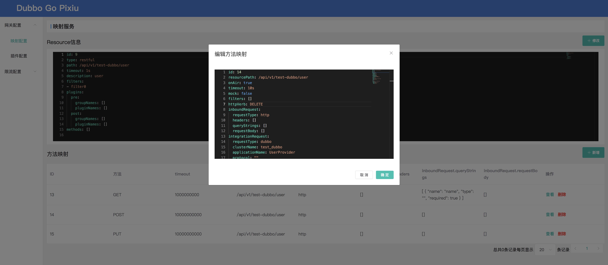

Note: The ID cannot be modified, and even after saving changes, it will revert to the old value. Click "Confirm" to update the method mapping.

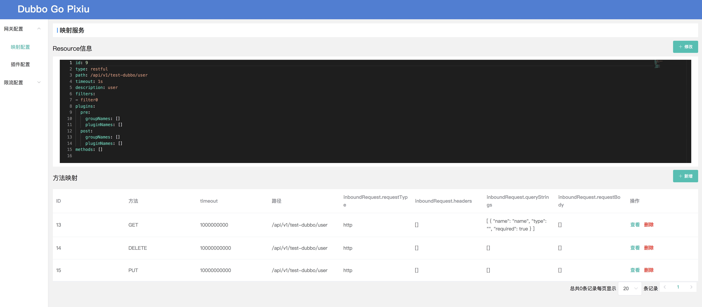

### Manage Plugin Groups

#### Create Plugin Group

Click the "Plugin Configuration" menu on the left to view plugin-related configurations.

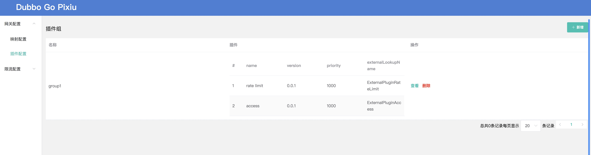

Click the "Add" button in the top right to create a new plugin group.

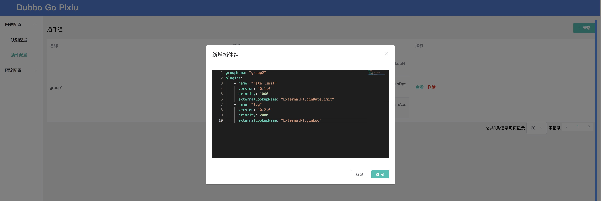

Plugin group configuration example:

```yaml
groupName: "group2"
plugins:
  - name: "rate limit"
    version: "0.1.0"
    priority: 1000
    externalLookupName: "ExternalPluginRateLimit"
  - name: "log"
    version: "0.2.0"
    priority: 2000
    externalLookupName: "ExternalPluginLog"
```

After saving, the list will refresh to show the newly created plugin group.

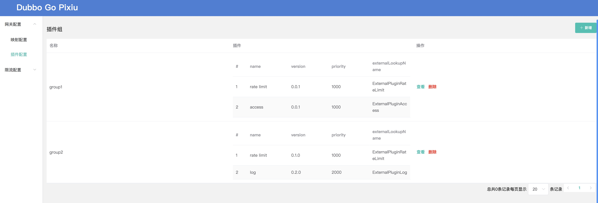

Similar to mapping configurations, you can click "View" to edit the plugin group configuration, or click "Delete" to remove the entire plugin group configuration.

#### View and Delete Plugin Groups

Click "View" to edit the plugin group configuration, or "Delete" to remove the plugin group.

### Manage Rate Limiting Configuration

#### Configure Rate Limiting

Click the "Rate Limiting Configuration" menu to configure the rate-limiting components. Example configuration:

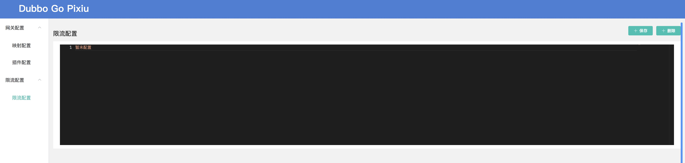

```yaml
resources:
  - name: test-http
    items:
      - pattern: /api/v1/test-dubbo/user
      - matchStrategy: 1
        pattern: /api/*/test-dubbo/user
rules:
  - flowRule:
      resource: ""
      tokencalculatestrategy: 0
      threshold: 100
      enable: true
```

After saving, the rate-limiting configuration will take effect.

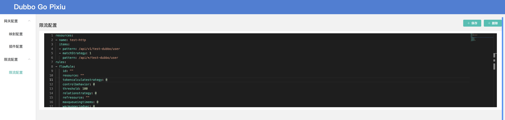

### Manage OPA Policy Configuration

#### Configure OPA Policy

Click the "OPA Policy Configuration" menu to manage the OPA policy. You can change `policy_id`, synchronize the latest policy from the OPA server, and edit Rego policy content in the editor.

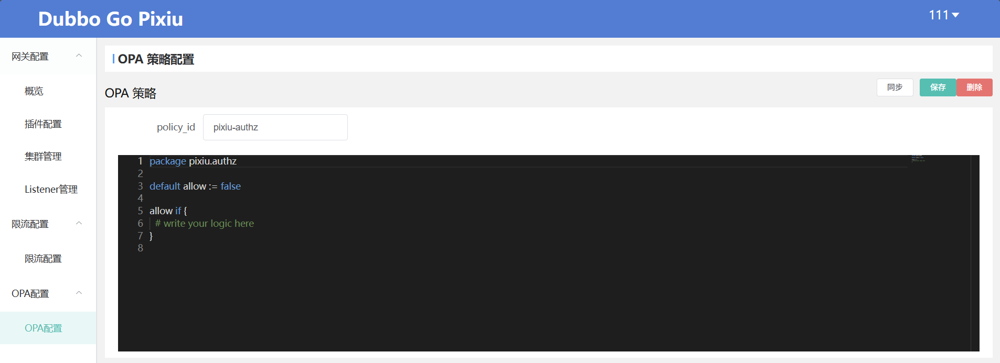

After editing, click "Save" to upload the policy to OPA. You can also click "Delete" to remove the policy.

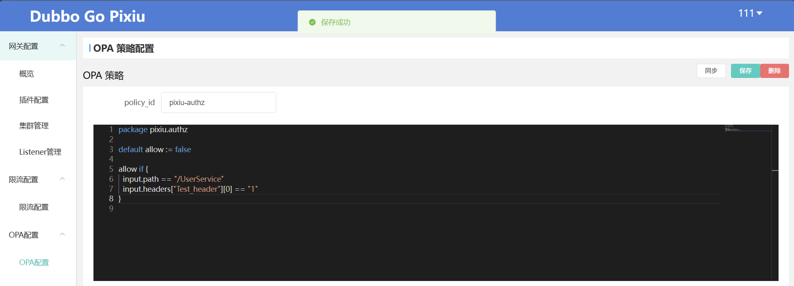

## III. Pixiu Remote Configuration

### Start and Configure

Start Pixiu and specify the configuration file. In the configuration file, define the etcd address and configuration path:

```yaml
api_meta_config:
  address: "127.0.0.1:2379"
  api_config_path: "/pixiu/config/api"
```

### Test

Create resource configurations in the admin panel and test Pixiu forwarding functionality using `curl`:

```bash
curl "http://127.0.0.1:8888/api/v1/test-dubbo/user?name=tc"
curl -X POST "http://127.0.0.1:8888/api/v1/test-dubbo/user?name=tc"
```

If no matching service is found, an error message will be returned; if the configuration is correct, the service response will be returned.

## License

This project is licensed under the Apache License 2.0.
